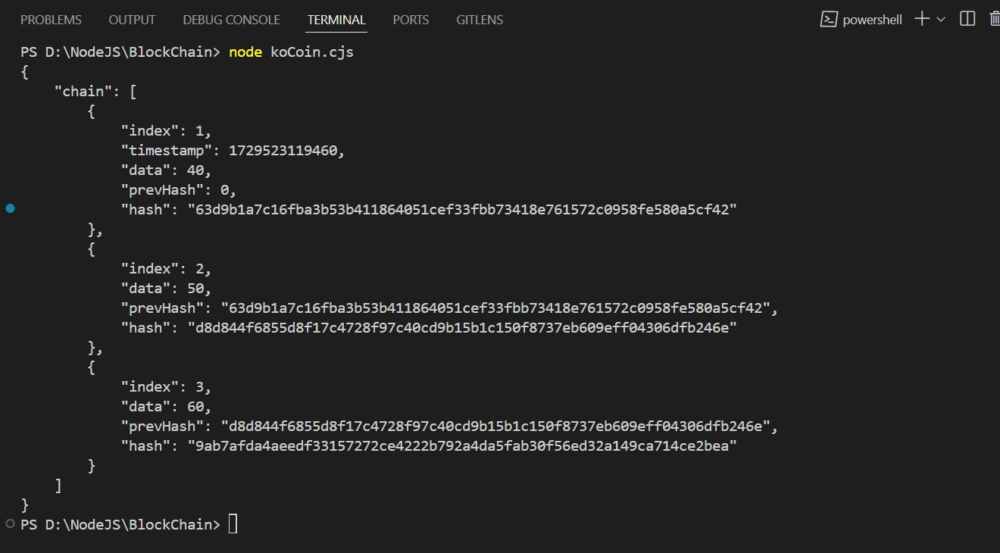

This is basic implementation of a blockchain using JS. We are calling this currency as koCoin. 

# implementation demos

Whats done 

# Basic block and blockChain structure added.
# Use diff js package for hash generation.
# Use native js package CRYPTO for hash generation.

To implement
 
# add isValidChain checks
# add proof of work feature